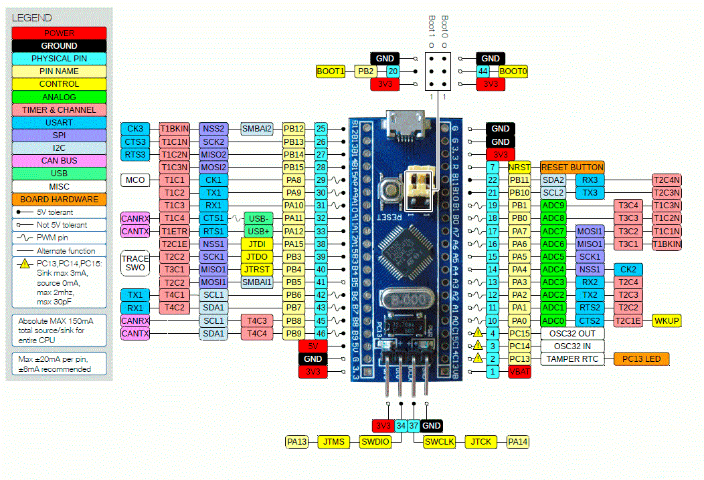

# Microcontrollers ⚙️
This repository contains the practices and the final project of the Microcontrollers discipline carried out in 2025. To carry out these practices and the final work, the STM32F103 microcontroller and the STM32CubeIDE were used.

## Practice 0++
Redo Practice 0 including some strategy to reduce energy consumption, changing the Clock frequency and/or using power management hardware.

## Practice 1 - GPIO
Connect 3 push buttons and 3 LEDs to the STM32F103. Each push button should trigger a different LED via pulling.

## Practice 2 - External Interruption
Using again 3 push buttons and an RGB LED (or 3 different LEDs), use the push buttons to change the state of each of the LEDS (XOR) using different external interrupts.

## Practice 3 - SysTick
Use SysTick to alternately trigger all color combinations of an RGB LED with a 1s interval between them {Off, Red, Green, Blue, Yellow, Cyan, Purple, White}

## Practice 4 - Timer
Use the uC timer to flash each of the color combinations of an RGB LED twice

## Practice 5 - PWM
Use the uC's PWM to slowly turn on and off each of the RGB LED color combinations (Red, Green, Blue, Yellow, Cyan, Purple, White).

NOTE: The use of delays or similar functions is not permitted. A second timer must be configured to vary the duty cycle.

## Practice 6 - ADC + PWM
Use three distinct analog channels to control the brightness of the primary colors in an RGB LED.

Suggestion: Use PWM to control the LEDs and the output of the A/D converter to adjust the duty cycle.

Suggestion: Use DMA and the A/D converter's SCAN mode to automate readings.

## Practice 7 - Control via USART
Control the duty cycle of PWM channels connected to an RGB LED via USART. The STM32 must be able to recognize the following commands:

1) rXX or RXX, bXX or BXX, gXX or GXX - Changes the duty cycle of the PWM controlling the Red (r or R), Blue (b or B), or Green (g or G) LEDs to the value indicated in XX (00 to 99). Note the presence of the '\n' character to end the command.

2) d or D - Enters or exits {TOOGLE} demo mode, equivalent to the behavior described in Practice 05.

NOTE: During demo mode, the STM32 must ignore other commands.